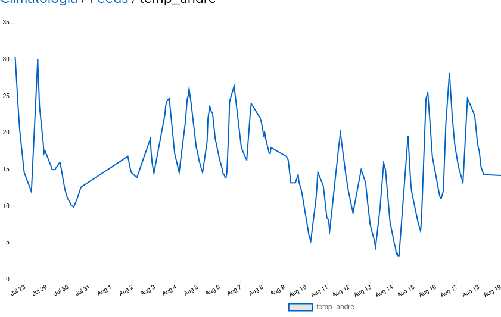
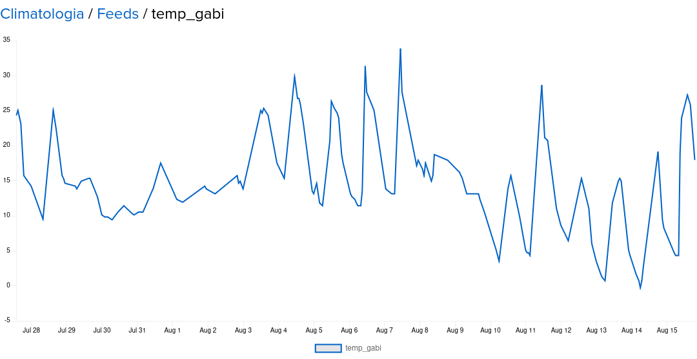

## Clima Urbano UFPR

O projeto [**Clima Urbano UFPR**](Artigo.pdf) feito em conjunto com *Gabriela Freire Portugal* e *Izabela Scremin*, é uma solução para monitoramento e análise de condições climáticas urbanas utilizando um microcontrolador ESP32. Este projeto foi desenvolvido para um projeto de climatologia na Universidade Federal do Paraná (UFPR) e integra vários componentes para fornecer dados precisos sobre o clima.

### Descrição

O sistema é composto por um microcontrolador ESP32, que coleta dados de um sensor de temperatura e umidade DHT11. Os dados coletados são então enviados para uma plataforma de monitoramento através do protocolo MQTT, permitindo a visualização em tempo real e o armazenamento dos dados para análise posterior.

### Funcionalidades

- **Monitoramento Climático**: O sensor DHT11 fornece leituras de temperatura e umidade, que são essenciais para o estudo das condições climáticas urbanas.
- **Comunicação MQTT**: O ESP32 utiliza o protocolo MQTT para transmitir dados para um broker MQTT. Isso permite a integração com diversas plataformas de monitoramento e análise.
- **Integração com Plataforma**: Os dados enviados podem ser utilizados para gerar gráficos e relatórios, oferecendo uma visão detalhada das condições climáticas em áreas urbanas.

### Componentes Utilizados

- **Microcontrolador ESP32**: Um microcontrolador com conectividade Wi-Fi e Bluetooth, ideal para aplicações de IoT (Internet das Coisas).
- **Sensor DHT11**: Um sensor de temperatura e umidade com precisão adequada para aplicações de monitoramento climático.
- **MQTT**: Protocolo de comunicação leve para transmissão de dados entre o microcontrolador e a plataforma de monitoramento.

### Instalação e Configuração

1. **Configuração do Hardware**: Conecte o sensor DHT11 ao ESP32 conforme o diagrama de conexão fornecido no repositório.
2. **Configuração do Software**: Configure o ambiente de desenvolvimento para o ESP32 e instale as bibliotecas necessárias para o MQTT e o sensor DHT11.
3. **Deploy**: Carregue o código no ESP32 e ajuste as configurações do broker MQTT para começar a receber os dados.

### Imagem dos dados de temperatura 

